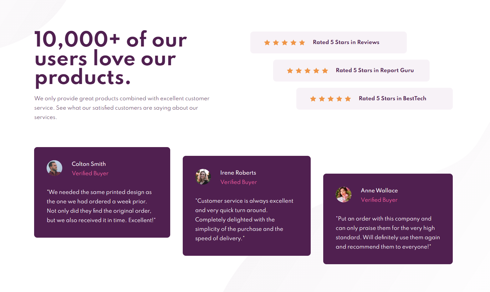

# Frontend Mentor - Social proof section solution

This is a solution to the [Social proof section challenge on Frontend Mentor](https://www.frontendmentor.io/challenges/social-proof-section-6e0qTv_bA). Frontend Mentor challenges help you improve your coding skills by building realistic projects.

### About

Sixth exercice from Frontend Mentor website. The purpose is to train HTML, SCSS.

**HTML, SCSS**

[Preview-site](https://florianjourde.github.io/Frontend-Mentor-6-Social-proof-section-master)
